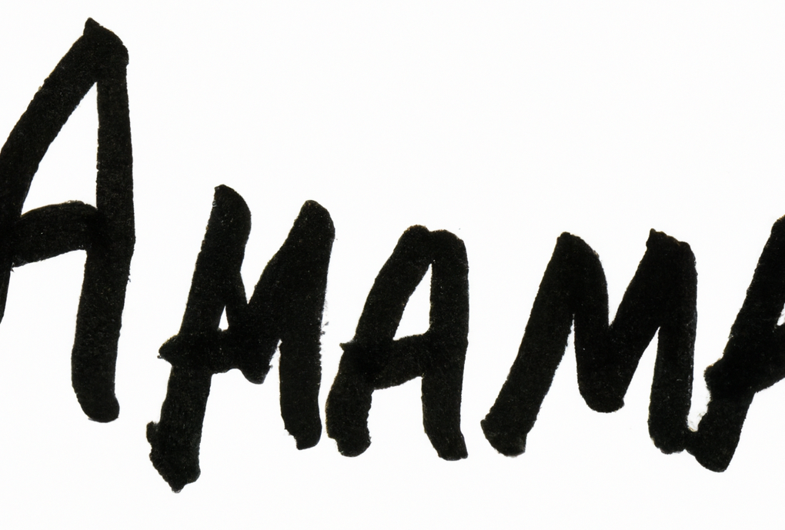
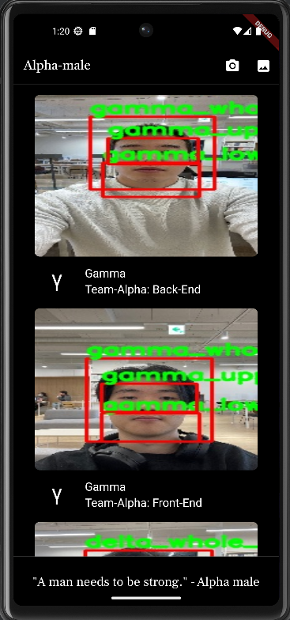
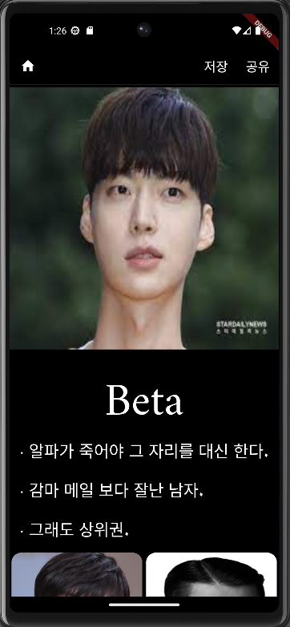

# ALPHA PROJECT

    

      
    

    

        <em>.paint by dall-e-2</em>
    
 
    

        <strong>GitHub Repository</strong>  
        <a href="https://github.com/sangrokjung/alpha_male_Front"><strong> Mobile GitHub Repo</strong></a> · 
        <a href="https://github.com/sangrokjung/alpha_male_dl_server"><strong> DL Server GitHub Repo</strong></a>
    

## About Project

    

        
        
    

### KEY ACTIVITES
> **DL을 활용한 남성 얼굴 유형 분류.**  
> **사용자가 속한 유형별 남성 이미지 제공.**

### KEY RESOURCES
> **설문을 통한 분류한 남성 유명인 얼굴 유형 이미지 데이터.**  

### VALUE PROPOSITION
> **자신의 외모 유형이 궁금한 사람들을 AI를 통해 궁금증을 해소 할 수 있게 도와준다.**  
> **결과로 도출된 유형에 따라 사용자는 만족감을 얻거나 타인 지인과 비교하여 부가적인 즐거움을 얻을 수 있다.**

### CHANNELS
> **Application**  

### CUSTOMER SEGEMENTS
> **자신 또는 타인의 외모 유형이 궁금한 사람**  

## TECH Used

### MOBILE

    
    
    
    

### BACK-END

    
    
    
    
    
    
    

### CLOUD

    
    
    
    

### DL/ML

    
    
    
    
    
    
    

## Project Team

**SangRok Jung** : <a href="https://github.com/sangrokjung" target="_blank">github</a> - sesilao@naver.com
> * Lead
>   * Project Lead.
>   * Managing GitHub Repositories and Policies.
>   * Notion, Upbase Management.
>   * Manage schedules.
>   * Planning and production of readme.
> * Back-End
>   * Imaging DL Servers with Dockers
>   * Leverage FastAPI to create POST Protocols for the Client to send.
>   * Create an API to call DL.
>   * Create an API that stores data sent by the Client in DB.
>   * Connect with DataBase.
> * Cloud
>   * Building an EC2 Ubuntu environment for DL learning. (G4dn, P4)
>   * Deploying DL Server CICD with GitHub Actions and S3, EC2.
>   * Deploying Back-End Server CICD with GitHub Actions and ECR, ECS, and ELB.
>   * Deploying RDBMS PostgreSQL using RDS.
> * DataBase.
>   *  Schema, table, and data CRUD utilizing PostgreSQL.
>   *  ERD Production.
> * Mobile
>   * Design with Mockup.
> * DL/ML
>   * Collection of data through crawling.

**Seungwon Lee** : <a href="https://github.com/diet-teacher" target="_blank">github</a> - lsw4556@daum.net
> * DL/ML
>   * Collection of data through crawling.
>   * Analyse surveyed data and visualized it using matplotlib and pandas
>   * Trained the first DL model to find out human face is exist using Pytorch
>   * Trained the second DL model that for auto labeling using Pytorch
>   * Trained the third DL model to detect three parts of faces and classify there class using Pytorch

**Jaehee Han** : <a href="https://github.com/82Hardy-J" target="_blank">github</a> - handjh6903@naver.com
> * Team work
>   * Execute Leader's Command, Compliance with project rules.
> * Mobile
>   * Camera function and album function were activated using Image Picker.
>   * It makes a request to the server using HTTP and Post and responds with information.
>   * Parse the data received as a response using HTTP and put
>   * Give the user MainPage, SelectPage,Show the ResultPage.
>   * Create the features required for each page.
>   * Designed the app logo.
> * DL/ML
>   * Collection of data through crawling.

---

