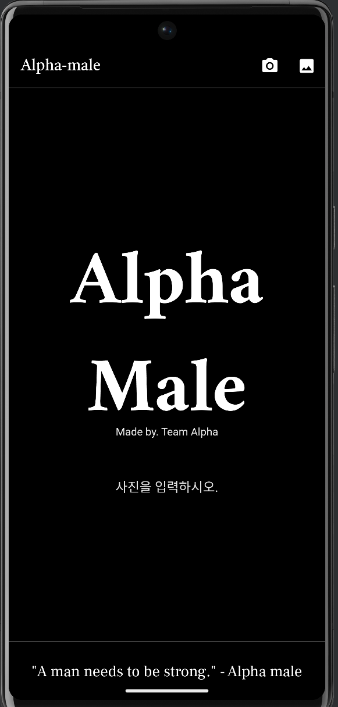
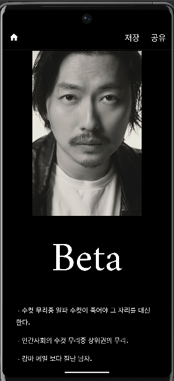

# ALPHA PROJECT
<div>
    <p align="center">
        
        <br>
    </p>
    <p align="center">
        <em>.paint by dall-e-2</em>
    </p> 
    <p align="center">
        <strong>GitHub Repository</strong> <br>
        <a href="https://github.com/sangrokjung/alpha_male_Front"><strong> Mobile GitHub Repo</strong></a> · 
        <a href="https://github.com/sangrokjung/alpha_male_dl_server"><strong> DL Server GitHub Repo</strong></a><br>
        <a href="https://youtube.com/shorts/-TZ80QRXgpo?feature=share"><strong> Application Guide Video</strong></a> · 
        <a href="https://youtu.be/UgHFImf1tXE"><strong> Application demonstration Video</strong></a><br>
        <a href="https://youtu.be/dQWDqNlcE74"><strong>PPT Video</strong></a>
    </p>
</div>

<br>

<!-- TABLE OF CONTENTS -->
<details>
  <summary>Table of Contents</summary>
  <ol>
    <li><a href="#about-project">About Project</a>
    <li><a href="#tech-used">Tech Used</a>
    <li><a href="#project-team">Project Team</a></li>
    <li><a href="#user-stories">User Stories</a></li>
    <li><a href="#survey">Survey</a></li>
    <li><a href="#back-end-server">Back-End Server</a></li>
    <li><a href="#dl-server">DL Server</a></li>
    <li><a href="#data-base">Data Base</a></li>
    <li><a href="#dl">DL</a></li>
    <li><a href="#mobile">Mobile</a></li>
  </ol>
</details>

<br>

<!-- ABOUT PROJECT -->
## About Project

<div>
    <p align="center">
        
        
    </p>
    <p align="center">
        
    </p>
</div>


# KOR


## BMC
### KEY ACTIVITES
> **DL을 활용한 남성 얼굴 유형 분류.** <br>
> **사용자가 속한 유형별 남성 이미지 제공.**

### KEY RESOURCES
> **설문을 통한 분류한 남성 유명인 얼굴 유형 이미지 데이터.** <br>

### VALUE PROPOSITION
> **자신의 외모 유형이 궁금한 사람들을 AI를 통해 궁금증을 해소 할 수 있게 도와준다.** <br>
> **사용자는 AlphaMale을 통해 자신의 얼굴이 어떤 유형에 속하는지 알 수 있고 주변 지인들과 결과를 공유, 비교하며 즐거움을 얻을 수 있을 것이다.**

### CHANNELS
> **Application : "AlphaMale"** <br>

### CUSTOMER SEGEMENTS
> **자신 또는 타인의 외모 유형이 궁금한 사람** <br>

### 추진 방향
> **대한민국 20~30대 성인 남녀 100여명의 설문조사를 통해 얻은 데이터를 바탕으로 대한민국 남자 유명인 110명의 얼굴 유형을 분류.**<br>
> **설문조사를 통해 분류된 유명인의 얼굴을 3분할(얼굴 전체, T-Zone, 하관)하여 FPN이 도입된 Faster RCNN 방식의 multi object detection model 학습.**<br>
> **학습이 완료된 model을 통해 사용자의 얼굴 유형을 분석 후 결과 제공.**


<br><br>

<!-- TECH USED -->
## TECH Used

### MOBILE
<p align="left">
    
    
    
    
</p>

### BACK-END
<p align="left">
    
    
    
    
    
    
    
</p>

### CLOUD
<p align="left">
    
    
    
    
</p>

### DL/ML
<p align="left">
    
    
    
    
    
    
    </p>


<br><br>

<!-- PROJECT TEAM -->
## Project Team


**정상록** : <a href="https://github.com/sangrokjung" target="_blank">github</a> - sesilao@naver.com
> * Lead
>   * 프로젝트 운영 및 관리.
>   * GitHub 정책 설정 및 운영 관리.
>   * Notion, Upbase를 통한 에자일 운영.
>   * PPT 기획 및 관리.
> * Back-End
>   * Docker를 활용한 서버 빌드.
>   * FastAPI를 활용한 API 개발, RDS, S3 연동.
> * Cloud
>   * EC2(Ubuntu, (G4dn, P4))를 활용한 딥러닝 모델 학습 서버 구축. 
>   * S3, EC2를 환용한 딥러닝 서버 개발 및 배포. 
>   * ECS를 활용한 백엔드 서버 개발 및 배포.
>   * GitHub Actions를 통한 딥러닝, 백엔드 서버 CICD 구축.
>   * RDS(PostgreSQL)를 활용한 DB Server 구축
> * DataBase.
>   *  PostgreSQL를 활용한 DB 구축 및 운영, 관리.
>   *  ERD 설계.
> * Mobile
>   * Uizard를 활용한 디자인 목업
> * DL/ML
>   * Selenium을 활용한 이미지 데이터 크롤링.


**이승원** : <a href="https://github.com/diet-teacher" target="_blank">github</a> - lsw4556@daum.net
> * DL/ML
>   * 크롤링을 통한 데이터 수집.
>   * matplotlib와 Pandas를 활용한 설문조사 데이터 분석 및 시각화.
>   * Pytorch를 활용한 사람의 안면을 인식하는 첫번째 DL 모델 학습.
>   * Pytorch를 활용한 auto labeling을 하는 두번째 DL 모델 학습.
>   * Pytorch를 활용한 안면의 세가지 파트를 분류하는 하는 세번째 DL 모델 학습.

**한재희** : <a href="https://github.com/82Hardy-J" target="_blank">github</a> - handjh6903@naver.com
> * Mobile
>   * Image Picker를 활용한 카메라 기능 및 앨범 기능 활성화.
>   * HTTP Method를 통한 서버 호출 및 응답 수신.
>   * 서버에서 응답 받은 데이터 분석.
>   * MainPage, Select Page, ResultPage 개발.
>   * 로고 디자인.
> * DL/ML
>   * Selenium을 활용한 이미지 데이터 크롤링.
>   * 모델 QA/Testing.

<br><br>

<!-- USER STORIES -->
## User Stories
> Epics
> * 메인 (뷰)
>     * 카메라 버튼
>     * 갤러리 버튼
> * 이미지 입력 (뷰)
>     * 카메라
>         * 카메라 촬영 버튼
>     * 갤러리
>         * 갤러리 사진 선택
> * 이미지 로드 (뷰)
>     * 카메라 촬영 결과 or 갤러리에서 선택 된 이미지
>     * MBTI 인풋(메뉴 리스트)
>     * 생년월일 인풋(calendar)
>     * 분석 버튼 (비활성 : 회색, 활성 : 유색)
>     * 뒤로 가기 버튼
> * 결과(뷰)
>     * 홈 버튼
>     * 공유하기 버튼
>     * 이미지 저장 버튼
> 
> 
> 
> Stories
> * 메인(뷰)
>     * 사용자 스토리
>         * 사용자는 알파메일의 메인뷰에 진입한다.
>         * 사용자는 카메라 버튼을 클릭한다.
>         * 사용자는 갤러리 버튼은 클릭한다.
>     * 시스템 스토리
>         * 시스템(클라이언트)은 휴대폰 카메라에 연결한다.
>         * 시스템(클라이언트)은 휴대폰 카메라에 연결한다.
>         * 시스템(클라이언트)은 휴대폰 갤러리의 사진을 불러온다.
> * 이미지 입력 (뷰)
>     * 사용자 스토리
>         * 카메라
>             * 사용자는 카메라 촬영 버튼을 누른다.
>             * 사용자는 뒤로 가기 버튼을 누른다.
>                 * 사용자는 메인 뷰로 돌아간다.
>         * 갤러리
>             * 사용자는 사진을 선택한다.
>             * 사용자는 뒤로 가기 버튼을 누른다.
>                 * 사용자는 메인 뷰로 돌아간다.
>     * 시스템 스토리
>         * 시스템(클라이언트)은 사용자가 뒤로 가기 선택시 메인 뷰로 돌아간다.
> * 이미지 로드 (뷰)
>     * 사용자 스토리
>         * 사용자는 자신의 이미지를 확인한다.
>         * 사용자는 MBTI와 생년월일을 입력하지 않고 분석 버튼을 누른다.
>             * 사용자는 알림창을 본다.
>             * 사용자는 알림창을 터치하고 다시 데이터를 입력한다.
>         * 사용자는 MBTI를 입력한다.
>         * 사용자는 생년월일을 입력한다.
>         * 사용자는 분석 버튼을 누른다.
>     * 시스템 스토리
>         * 시스템(클라이언트)은 사용자가 생년월일과 MBTI를 입력하지 않고 분석 버튼을 누를시 아무일도 발생시키지 않는다.
>         * 시스템(클라이언트)은 사용자가 생년월일과 MBTI를 입력하고 분석 버튼을 누르면 사용자에게 로딩중 화면을 출력한다.
>         * 시스템(클라이언트)은 사용자의 이미지를 base64 string type 변환하고 생년월일과 MBTI 데이터를 시스템(백엔드 서버)로 POST한다.
>             * 시스템(벡엔드 서버)는 DL_model1을 통해 이미지에 사람 얼굴이 존재하는지 validation 한다.
>                 * 시스템(벡엔드 서버)는 얼굴이 존재하지 않으면 시스템(클라이언트)에 에러를 response한다.
>                     * 시스템(클라이언트)은 0을 response 받으면 “위와 같은 구도의 사진을 선택해 주세요.”라는 text와 사진 구도 예시 이미지를 출력한다.
>                 * 시스템(벡엔드 서버)는 얼굴이 존재하면  DL_model2를 통해 얼굴 유형을 분석하고 AWS S3 버킷에 이미지를 저장한다.
>                 * 시스템(백엔드 서버)는 최종 결과값[“human”, “male_type”, “dsc”, “imgge(각 유형별 random 유명인 이미지)”]을 시스템(클라이언트)에 response한다.
> * 결과(뷰)
>     * 사용자 스토리
>         * 사용자는 선택한 이미지에 대한 결과를 확인한다.
>         * 사용자는 결과에 대한 지표 상세 설명을 확인한다.
>         * 사용자는 공유버튼을 눌러 결과이미지를 공유한다.
>             * 사용자는 공유버튼의 옵션 중 카카오톡/ 페이스북/ 인스타그램 버튼을 이용해서 공유이미지 링크를 확인하고 공유한다.
>         * 사용자는 이미지 저장 버튼을 눌러 결과를 저장한다.
>         * 사용자는 결과값이 만족스럽지 않은 경우 백버튼(메인으로 이동)을 눌러 메인뷰로 재진입한다.
>     * 시스템 스토리
>         * 시스템(클라이언트)은 시스템(백엔드서버)로 부터 반환받은 결과값을 정해진 protocol([“human”, “male_type”, “dsc”, “imgge(각 유형별 random 유명인 이미지)”])을 기반으로 rendering한다.
>         * 시스템(클라이언트)은 결과를 공유한다.
>             * 카카오톡 / 문자 / Facebook / instagram


---

<br><br>

<!-- SURVEY -->
## 사전 설문조사
**팀원들 각자의 외모에 대한 기준이 서로 상이함에 따라 외모 유형을 나누는데 어려움이 존재.<br>
설문조사를 통해 많은 의견이 확보되면 누구나 어느정도 납득이 가능한 대중화된 데이터를 얻을수 있을 것을 기대함.**<br>

<p align="center">
    
</p>
<p align="center">
    <br>
    <strong>사전 설문조사 결과 순위</strong>
</p><br>

### 설문조사 기반의 데이터 분류 
> 설문결과 유형 분포에 110을 곱하면(조사 대상 유명인의 수) 각 유형별로 몇명의 유명인이 들어가는지 확인 할 수 있다.<br>
> 110 * 21.8 = 23.98 - Alpha <br>
> 110 * 21.4 = 23.54 - Beta <br>
> 110 * 22.5 = 24.75 - Gamma<br>
> 110 * 19.2 = 21.12 - Delta<br>
> 110 * 15.2 = 16.72 - Omega<br>
> 각각을 반올림해서 합하면 24 +24 + 25 + 21 +17 = 111이므로 소수점 첫째자리가 0.5로부터 가장 차이가 적은 Beta에서 1명을 뺀다.<br>
> 그러므로 설문조사 결과에는 Alpha : 24명, Beta : 23명, Gamma : 25명, Delta : 21명, Omega : 17명이 각각 분포한다고 판단 할 수 있다.<br>
> 외모 점수를 높게 받은 순(차은우, 원빈, ……, 국민의 힘 김재원, 오지헌)으로 Alpha부터 Omega까지 유형 분류 결과를 낼 수 있다.<br>


<p align="center">
    <br>
</p>

### 유형 분류 결과
> * Alpha : 차은우, 원빈, 현빈, 강동원, 뷔, 고수, 송강, 이동욱, 안정환 리즈, 서강준, 조인성, 정우성, 김수현, 공유, 박보검, 남주혁, 송중기, 송승헌, 임시완, 이종석, 정국, 장동건, 박형식
> * Beta : 정해인, 소지섭, 이병헌, 주지훈, 김희철, 차승원, 지성, 이승기, 강하늘, 유아인, 안재현, 조정석, 은지원, 민경훈, 유연석, 김우빈, 이정재, 차인표, 김래원, 오지호, 이선균, 하정우, 조규성, 송민호
> * Gamma : 침착맨, 지코, 조진웅, 황정민, 승리, 오정세, 류승룡, 이용진, 손흥민, 김종국, 류준열, 배우 김영철, 빅뱅 태양, 정우, 하하, 성시경, 송강호, 류승범, 기안84, 문재인, 윤도현, 유재석, 김동현, 이수근, 문상훈
> * Delta : 홍석천, 이준석, 유병재, 김풍, 강호동, 남창희, 유승민, 이진호, 마동석, 조세호, 피식대학 김민수, 주호민, 박지성, 윤석열, 이재명, 안철수, 장동민, 김범수, 이천수, 대성, 고창석
> * Omega : 홍구, 오메가 사피엔, 진중권, 천하람, 미키광수, 최욱, 곽튜브, 딕헌터, 오달수, 흑자헬스, 변희재, 래퍼 면도, 염따, 김제동, 정종철, 국민의 힘 김재원, 오지헌


<br><br>

<!-- BACK-END SERVER -->
## BACK-END SERVER

**Before building a DL server, build a backend server to develop protocols to send and receive with the Client.**

### Structuring FastAPI 

```bash
app
├── __init__.py
├── main.py
├── core
│   ├── models
│   │   ├── database.py
│   │   ├── models.py
│   │   └── __init__.py
│   └── schemas
│       ├── __init__.py
│       └── schema.py
└── v1
    ├── api.py
    ├── load.py
    ├── s3.py
    └── __init__.py 
```


### API
**1. 클라이언트에서 서버와 합의한 대로 매개변수에 데이터를 입력합니다.**<br>
**2. 클라이언트가 입력한 파라미터 결과값에 따라 사용자 데이터는 DB에 저장되고, 클라이언트는 Response body 값을 얻습니다.**
```python
@router.post("/RegisterUserImg_sample")
async def RegisterUserImg_sample(first_user: first_user_tbl, Model_rst:int, result: last_result, db: Session = Depends(get_db)):
    c_first_user = models.Users()
    c_first_user.user_img = first_user.user_img
    c_first_user.age = first_user.age
    c_first_user.mbti = first_user.mbti

    Model_rst

    if Model_rst == 0 or Model_rst == 6:
        return result
    elif Model_rst >= 1 and Model_rst < 6:
        s3_url = handle_upload_img(first_user.user_img) # S3에 파일을 전송함과 동시에\ 주소 획득.
        Model_rst = Model_rst
        result.human = "True"
        type = conv_type(Model_rst)
        if Model_rst == 1:
            result.male_type = "Alpha"
            result.dsc = db.query(models.Male).filter(models.Male.male_type == "alpha").first().dsc_text
            ID = make_4_num(27, 36)
            result.img1 = db.query(models.Male_IMG).filter(models.Male_IMG.male_id == Model_rst, models.Male_IMG.id == ID[0]).first().url
            result.img2 = db.query(models.Male_IMG).filter(models.Male_IMG.male_id == Model_rst, models.Male_IMG.id == ID[1]).first().url
            result.img3 = db.query(models.Male_IMG).filter(models.Male_IMG.male_id == Model_rst, models.Male_IMG.id == ID[2]).first().url
            result.img4 = db.query(models.Male_IMG).filter(models.Male_IMG.male_id == Model_rst, models.Male_IMG.id == ID[3]).first().url
        elif Model_rst == 2:
            result.male_type = "Beta"
            result.dsc = db.query(models.Male).filter(models.Male.male_type == "beta").first().dsc_text
            ID = make_4_num(37, 49)
            result.img1 = db.query(models.Male_IMG).filter(models.Male_IMG.male_id == Model_rst, models.Male_IMG.id == ID[0]).first().url
            result.img2 = db.query(models.Male_IMG).filter(models.Male_IMG.male_id == Model_rst, models.Male_IMG.id == ID[1]).first().url
            result.img3 = db.query(models.Male_IMG).filter(models.Male_IMG.male_id == Model_rst, models.Male_IMG.id == ID[2]).first().url
            result.img4 = db.query(models.Male_IMG).filter(models.Male_IMG.male_id == Model_rst, models.Male_IMG.id == ID[3]).first().url
        elif Model_rst == 3:
            result.male_type = "Gamma"
            result.dsc = db.query(models.Male).filter(models.Male.male_type == "gamma").first().dsc_text
            ID = make_4_num(50, 62)
            result.img1 = db.query(models.Male_IMG).filter(models.Male_IMG.male_id == Model_rst, models.Male_IMG.id == ID[0]).first().url
            result.img2 = db.query(models.Male_IMG).filter(models.Male_IMG.male_id == Model_rst, models.Male_IMG.id == ID[1]).first().url
            result.img3 = db.query(models.Male_IMG).filter(models.Male_IMG.male_id == Model_rst, models.Male_IMG.id == ID[2]).first().url
            result.img4 = db.query(models.Male_IMG).filter(models.Male_IMG.male_id == Model_rst, models.Male_IMG.id == ID[3]).first().url
        elif Model_rst == 4:
            result.male_type = "Delta"
            result.dsc = db.query(models.Male).filter(models.Male.male_type == "delta").first().dsc_text
            ID = make_4_num(63, 73)
            result.img1 = db.query(models.Male_IMG).filter(models.Male_IMG.male_id == Model_rst, models.Male_IMG.id == ID[0]).first().url
            result.img2 = db.query(models.Male_IMG).filter(models.Male_IMG.male_id == Model_rst, models.Male_IMG.id == ID[1]).first().url
            result.img3 = db.query(models.Male_IMG).filter(models.Male_IMG.male_id == Model_rst, models.Male_IMG.id == ID[2]).first().url
            result.img4 = db.query(models.Male_IMG).filter(models.Male_IMG.male_id == Model_rst, models.Male_IMG.id == ID[3]).first().url
        elif Model_rst == 5:
            result.male_type = "Omega"
            result.dsc = db.query(models.Male).filter(models.Male.male_type == "omega").first().dsc_text
            ID = make_4_num(74, 84)
            result.img1 = db.query(models.Male_IMG).filter(models.Male_IMG.male_id == Model_rst, models.Male_IMG.id == ID[0]).first().url
            result.img2 = db.query(models.Male_IMG).filter(models.Male_IMG.male_id == Model_rst, models.Male_IMG.id == ID[1]).first().url
            result.img3 = db.query(models.Male_IMG).filter(models.Male_IMG.male_id == Model_rst, models.Male_IMG.id == ID[2]).first().url
            result.img4 = db.query(models.Male_IMG).filter(models.Male_IMG.male_id == Model_rst, models.Male_IMG.id == ID[3]).first().url
        c_first_user.user_img_s3_url = s3_url
        c_first_user.cft_result = type
        c_first_user.created_at = datetime.now()
        c_first_user.created_by = "JSR"
        db.add(c_first_user)
        db.commit()

        return result
```

### CICD
**1. 로컬 환경에서 개발자는 GitHub으로 Push나 Merge를 합니다.** <br>
**2. GitHub Action가 작성한 yml 파일에 맞추어 실행됩니다.** <br>
**3. GitHub Action에 따라 dcooker image를 ECR에 저장합니다.** <br>
**4. GitHub Action에 따라 ECS 작업 정의를 수행합니다.** <br>
**5. 구성된 서비스에 따라 서버를 ELB에 배포합니다.**<br>
<p align="center">
    
</p>

### Docker
**이미지는 파이썬 3.10을 기반으로 구축되었습니다. <br>
설치가 필요한 패키지는 requirements를 통해 설치되었습니다. .**
```dockerfile
FROM python:3.10-alpine

WORKDIR /app

COPY ./requirements.txt /app/requirements.txt

RUN echo $PATH
RUN echo "export PATH=$PATH:/usr/local/bin/docker" >> ~/.bashrc
RUN cat ~/.bashrc
RUN echo $PATH

RUN pip install --no-cache-dir --upgrade -r /app/requirements.txt

COPY . /app/

CMD [ "uvicorn", "app.main:app", "--reload", "--workers", "1", "--host", "0.0.0.0", "--port", "80" ]

COPY ./ /app/
```

<br><br>

<!-- DL SERVER -->
## DL Server

**클라이언트가 서버의 API를 호출하면, 학습된 DL MODEL을 통해 결과값을 DB와 S3 Bucket에 저장하고 응답 본문을 클라이언트에 반환합니다.**

### API
**1. 클라이언트가 전송한 사용자 데이터를 입력합니다.** <br>
**2. 사용자 데이터의 사용자 이미지를 학습한 DL MODEL을 통해 결과값을 반환합니다.**<br>
**3. DL MODEL의 결과 값에 따라 설정된 프로토콜에 따라 클라이언트에 응답 본문이 전송되고, 데이터는 DB와 S3에 저장됩니다.**<br>

```python
@router.post("/RegisterResult")
async def RegisterResult(first_user: first_user_tbl, result: last_result, db: Session = Depends(get_db)):
    c_first_user = models.Users()
    c_first_user.user_img = first_user.user_img
    c_first_user.age = first_user.age
    c_first_user.mbti = first_user.mbti

    Model_rst = run(first_user.user_img)

    if Model_rst == 0 or Model_rst == 6:
        return result
    elif Model_rst >= 1 and Model_rst < 6:
        s3_url = handle_upload_img(first_user.user_img)  # S3에 파일을 전송함과 동시에\ 주소 획득.
        Model_rst = Model_rst
        result.human = "True"
        type = conv_type(Model_rst)
        if Model_rst == 1:
            result.male_type = "Alpha"
            result.dsc = db.query(models.Male).filter(models.Male.male_type == "alpha").first().dsc_text
            ID = make_4_num(27, 36)
            result.img1 = db.query(models.Male_IMG).filter(models.Male_IMG.male_id == Model_rst,
                                                           models.Male_IMG.id == ID[0]).first().url
            result.img2 = db.query(models.Male_IMG).filter(models.Male_IMG.male_id == Model_rst,
                                                           models.Male_IMG.id == ID[1]).first().url
            result.img3 = db.query(models.Male_IMG).filter(models.Male_IMG.male_id == Model_rst,
                                                           models.Male_IMG.id == ID[2]).first().url
            result.img4 = db.query(models.Male_IMG).filter(models.Male_IMG.male_id == Model_rst,
                                                           models.Male_IMG.id == ID[3]).first().url
        elif Model_rst == 2:
            result.male_type = "Beta"
            result.dsc = db.query(models.Male).filter(models.Male.male_type == "beta").first().dsc_text
            ID = make_4_num(37, 49)
            result.img1 = db.query(models.Male_IMG).filter(models.Male_IMG.male_id == Model_rst,
                                                           models.Male_IMG.id == ID[0]).first().url
            result.img2 = db.query(models.Male_IMG).filter(models.Male_IMG.male_id == Model_rst,
                                                           models.Male_IMG.id == ID[1]).first().url
            result.img3 = db.query(models.Male_IMG).filter(models.Male_IMG.male_id == Model_rst,
                                                           models.Male_IMG.id == ID[2]).first().url
            result.img4 = db.query(models.Male_IMG).filter(models.Male_IMG.male_id == Model_rst,
                                                           models.Male_IMG.id == ID[3]).first().url
        elif Model_rst == 3:
            result.male_type = "Gamma"
            result.dsc = db.query(models.Male).filter(models.Male.male_type == "gamma").first().dsc_text
            ID = make_4_num(50, 62)
            result.img1 = db.query(models.Male_IMG).filter(models.Male_IMG.male_id == Model_rst,
                                                           models.Male_IMG.id == ID[0]).first().url
            result.img2 = db.query(models.Male_IMG).filter(models.Male_IMG.male_id == Model_rst,
                                                           models.Male_IMG.id == ID[1]).first().url
            result.img3 = db.query(models.Male_IMG).filter(models.Male_IMG.male_id == Model_rst,
                                                           models.Male_IMG.id == ID[2]).first().url
            result.img4 = db.query(models.Male_IMG).filter(models.Male_IMG.male_id == Model_rst,
                                                           models.Male_IMG.id == ID[3]).first().url
        elif Model_rst == 4:
            result.male_type = "Delta"
            result.dsc = db.query(models.Male).filter(models.Male.male_type == "delta").first().dsc_text
            ID = make_4_num(63, 73)
            result.img1 = db.query(models.Male_IMG).filter(models.Male_IMG.male_id == Model_rst,
                                                           models.Male_IMG.id == ID[0]).first().url
            result.img2 = db.query(models.Male_IMG).filter(models.Male_IMG.male_id == Model_rst,
                                                           models.Male_IMG.id == ID[1]).first().url
            result.img3 = db.query(models.Male_IMG).filter(models.Male_IMG.male_id == Model_rst,
                                                           models.Male_IMG.id == ID[2]).first().url
            result.img4 = db.query(models.Male_IMG).filter(models.Male_IMG.male_id == Model_rst,
                                                           models.Male_IMG.id == ID[3]).first().url
        elif Model_rst == 5:
            result.male_type = "Omega"
            result.dsc = db.query(models.Male).filter(models.Male.male_type == "omega").first().dsc_text
            ID = make_4_num(74, 84)
            result.img1 = db.query(models.Male_IMG).filter(models.Male_IMG.male_id == Model_rst,
                                                           models.Male_IMG.id == ID[0]).first().url
            result.img2 = db.query(models.Male_IMG).filter(models.Male_IMG.male_id == Model_rst,
                                                           models.Male_IMG.id == ID[1]).first().url
            result.img3 = db.query(models.Male_IMG).filter(models.Male_IMG.male_id == Model_rst,
                                                           models.Male_IMG.id == ID[2]).first().url
            result.img4 = db.query(models.Male_IMG).filter(models.Male_IMG.male_id == Model_rst,
                                                           models.Male_IMG.id == ID[3]).first().url
        c_first_user.user_img_s3_url = s3_url
        c_first_user.cft_result = type
        c_first_user.created_at = datetime.now()
        c_first_user.created_by = "JSR"
        db.add(c_first_user)
        db.commit()

        return result
```

### CICD
**1-1. 로컬 환경에서 AWS CLI를 사용하여 모델 weight 파일 및 deploy.sh 파일을 S3 버킷에 푸시합니다.**<br>
**1-2. S3 버킷의 deploy.sh 파일을 EC2에서 CLI로 가져옵니다.**<br>
**1-3. 로컬 환경에서 DL SERVER를 GitHub로 푸시합니다.**<br>
**2. GitHub Actions이 실행됩니다.**<br>
**2-1. GitHub Actions에서 생성한 yml 파일에 따라 S3 버킷에 코드를 업로드합니다.**<br>
**3. GitHub Actions에서 생성한 yml 파일에 따라 모델 서버의 SSM 명령을 실행합니다.**<br>
**3-1. 모델 서버는 CLI를 통해 버킷의 모델 weight 파일을 가져옵니다.**<br>
**3-2. 도커 이미지를 구축합니다..**<br>
**3-3. docker container가 실행됩니다.**<br>
**4. 컨테이너가 이미 실행 중이면 중지하고 3-2부터 3-3까지 실행합니다..**<br>
<p align="center">
    
</p>

### Docker
**이미지는 우분투 기반 파이썬 3.10 버전으로 빌드되었습니다. <br>
설치가 필요한 패키지는 requirements를 통해 설치되었습니다.**


```dockerfile
FROM ubuntu:latest

WORKDIR /app

COPY ./requirements.txt /app/requirements.txt

# Install system dependencies
RUN apt-get update && apt-get install -y \
    python3.10 \
    python3.10-dev \
    python3-pip \
    libsm6 \
    libxext6 \
    libxrender-dev \
    libglib2.0-0 \
    libgl1-mesa-glx \
    libglib2.0-0 \
    libsm6 \
    libxext6 \
    libxrender-dev

RUN pip3 install opencv-python-headless

RUN pip install --no-cache-dir --upgrade -r /app/requirements.txt

COPY . /app/

CMD [ "uvicorn", "app.main:app", "--reload", "--workers", "1", "--host", "0.0.0.0", "--port", "80" ]

COPY ./ /app/
```

<br><br>

<!-- DATA BASE -->
## DataBase

**user_tbl** <br>
사용자가 입력한 데이터가 저장될 테이블입니다.
> * user_img_s3 : 사용자 이미지가 저장될 s3의 주소입니다.
> * user_img : USER IMG를 base64 형식으로 저장합니다.
> * cft_result : 사용자의 분류 결과.
> * age : 유저의 생년월일.
> * mbti : 유저의 MBTI. <br>

**male_tbl** <br>
DL 모델의 결과를 기반으로 클라이언트에 전송할 데이터 테이블입니다.
> * male_id : 분류 유형의 ID입니다.
> * male_type : 유형 분류 값입니다.
> * dsc_txt : 유형별 설명 값입니다. <br>
 
**img_tbl** <br>
> * male_id : 이미지 유형.
> * url : base64 형식으로 저장된 유형별 IMG.


<p align="center">
    
</p>


<br><br>

<!-- DL -->
## DL

**CelebA dataset** <br>

<p align="center">
    
</p>

> CelebA데이터 셋의 landmark 데이터를 활용한 cut_off model 및 auto labeling model 학습
**cut off model** <br>

<p align="center">
    
</p>

> 전체 얼굴을 탐지하는 cut_off model을 통하여 얼굴 전체가 어느 정도 나오지 않은 사진의 경우 분석을 cut_off 시켜버리게 됨.
**Auto labeling model** <br>

<p align="center">
    
</p>

> CelebA dataset을 활용해 학습한 auto labeling model
>   * 학습 데이터 자체가 정확하게 labeling되어 있지 않기 때문에 iou가 낮을 수 밖에 없다.
**얼굴 유형 분류 모델** <br>

<p align="center">
    
</p>

> 대한민국 유명인 110명의 데이터를 학습시킨 모델
> 모델 한계
>   * 1. 데이터를 수집할 때 인물 별 잘생김 정도가 아닌 부위 별 잘생김 정도를 수집했어야 했음.
>   * 2. 프로젝트 시간 관계 상 auto labeling을 위해 정확하지 않은 데이터를 사용하여 높은 iou를 기대하기 어렵다.

<br><br>

<!-- MOBILE -->
## Mobile
### Flutter를 사용한 이유.
### 1. 위젯
>   * Widget이란 Flutter에서 UI를 구성하는 모든 기본 요소를 말한다
>   * Flutter는 Widget을 사용하여 쉽고 빠르게 기능과 디자인을 진행 할 수 있다.
### 2. 시간
>   * 처음 접하는 앱 개발이라는 분야를 제한된 한달 동안 완성 해야 했기 때문에 쉽고 빠른 Flutter를 선택했다.
### 3. 선호도


<p align="left">
    
</p>


**Flutter가 RN에 비해 점유율과 선호도가 높으며 실제 사업및 실제 프로젝트에서 사용중이다.**


## 사용 방법
1. 어플을 설치 후 실행시킨다.
2. 오른쪽 상단 Appbar에 있는 카메라,앨범 아이콘 버튼을 눌러 상체 위로 나오는 촬영 및 사진 선택을 한다.
3. 촬영 및 사진선택후 선택페이지에서 MBTI,Birth,연봉을 입력 후 분석버튼을 누른다.
4. 잠시 기다린다음 결과페이지에서 본인의 분류된 정보를 확인한다.
5. 본인 정보를 확인하였으면 오른쪽 상단 스크린샷,공유 버튼을 눌러 앨범으로 저장 또는 SNS로 공유를 한다.
6. 다른 사진으로 다시 도전하고 싶다면 왼쪽 상단 집 모양 아이콘버튼을 누른후 2번으로 돌아가 다시 시도한다.


## 사용 패키지
>* Name : image_picker            version : ^0.8.6+1
>* Name : intl                    version : ^0.17.0
>* Name : share_plus              version : ^6.3.0
>* Name : screenshot              version : ^1.3.0
>* Name : path_provider           version : ^2.0.2
>* Name : carousel_slider         version : ^4.2.1
>* Name : flutter_native_splash   version : ^2.2.17
>* Name : gallery_saver           version : ^2.3.2
>* Name : flutter_spinkit         version : ^5.1.0


---

<br><br><br><br><br>

# ENG


## BMC
### KEY ACTIVITES
> **Male face type classification using DL.** <br>
> **Provide a male image for each type of user.**

### KEY RESOURCES
> **Image data of male celebrity face types classified by a survey.** <br>

### VALUE PROPOSITION
> **People who are curious about their appearance type can use AI to help them answer their questions.** <br>
> **With AlphaMale, users will be able to find out which type their face belongs to and have fun sharing and comparing results with their friends.**

### CHANNELS
> **Application : "AlphaMale"** <br>

### CUSTOMER SEGEMENTS
> **People who are curious about their own or others' appearance type** <br>

### Direction of travel
> **Classify the face types of 110 Korean male celebrities based on data from a survey of 100 Korean adults in their 20s and 30s.**<br>
> **Training a multi-object detection model with Faster RCNN with FPN by segmenting celebrity faces classified by a survey into three segments (full face, T-Zone, and lower canal).**<br>
> **Once trained, the model analyzes the user's face type and provides results.**


<!-- TECH USED -->
## TECH Used

### MOBILE
<p align="left">
    
    
    
    
</p>

### BACK-END
<p align="left">
    
    
    
    
    
    
    
</p>

### CLOUD
<p align="left">
    
    
    
    
</p>

### DL/ML
<p align="left">
    
    
    
    
    
    
    </p>


<br><br>

<!-- PROJECT TEAM -->
## Project Team


**SangRok Jung** : <a href="https://github.com/sangrokjung" target="_blank">github</a> - sesilao@naver.com
> * Lead
>   * Project Lead.
>   * Managing GitHub Repositories and Policies.
>   * Notion, Upbase Management.
>   * Manage schedules.
>   * Planning and production of readme.
>   * ppt planning and production.
> * Back-End
>   * Imaging DL Servers with Dockers
>   * Leverage FastAPI to create POST Protocols for the Client to send.
>   * Create an API to call DL.
>   * Create an API that stores data sent by the Client in DB.
>   * Connect with DataBase.
> * Cloud
>   * Building an EC2 Ubuntu environment for DL learning. (G4dn, P4)
>   * Deploying DL Server CICD with GitHub Actions and S3, EC2.
>   * Deploying Back-End Server CICD with GitHub Actions and ECR, ECS, and ELB.
>   * Deploying RDBMS PostgreSQL using RDS.
> * DataBase.
>   *  Schema, table, and data CRUD utilizing PostgreSQL.
>   *  ERD Production.
> * Mobile
>   * Design with Mockup.
> * DL/ML
>   * Collection of data through crawling.


**Seungwon Lee** : <a href="https://github.com/diet-teacher" target="_blank">github</a> - lsw4556@daum.net
> * DL/ML
>   * Collection of data through crawling.
>   * Analyse surveyed data and visualized it using matplotlib and pandas
>   * Trained the first DL model to find out human face is exist using Pytorch
>   * Trained the second DL model that for auto labeling using Pytorch
>   * Trained the third DL model to detect three parts of faces and classify there class using Pytorch

**Jaehee Han** : <a href="https://github.com/82Hardy-J" target="_blank">github</a> - handjh6903@naver.com
> * Team work
>   * Execute Leader's Command, Compliance with project rules.
> * Mobile
>   * Camera function and album function were activated using Image Picker.
>   * It makes a request to the server using HTTP and Post and responds with information.
>   * Parse the data received as a response using HTTP and put
>   * Give the user MainPage, SelectPage,Show the ResultPage.
>   * Create the features required for each page.
>   * Designed the app logo.
> * DL/ML
>   * Collection of data through crawling.
>   * Model Testing.


---

<br><br>

<!-- SURVEY -->
## Pre-survey
**Different team members have different standards for appearance, making it difficult to categorize appearance types.<br>
The hope is that if we get a lot of opinions through the survey, we'll be able to get mass-marketed data that everyone will find somewhat convincing.**<br>

<p align="center">
    
</p>
<p align="center">
    <br>
    <strong>사전 설문조사 결과 순위</strong>
</p><br>

### Survey-based data classification 
> Multiply the distribution of survey result types by 110 (the number of celebrities surveyed) to see how many celebrities are in each type.<br>
> 110 * 21.8 = 23.98 - Alpha <br>
> 110 * 21.4 = 23.54 - Beta <br>
> 110 * 22.5 = 24.75 - Gamma<br>
> 110 * 19.2 = 21.12 - Delta<br>
> 110 * 15.2 = 16.72 - Omega<br>
> Rounding each one up, we get 24 +24 + 25 + 21 +17 = 111, so we subtract 1 from Beta, which is the least different from 0.5 to the first decimal place.<br>
> Therefore, we can conclude that the survey results are distributed as follows: Alpha: 24, Beta: 23, Gamma: 25, Delta: 21, and Omega: 17.<br>
> The order of the highest appearance scores (Cha Eun-woo, Won Bin, ......, Kim Jae-won, Oh Ji-heon, People's Power) can be used to categorize types from Alpha to Omega.<br>


<p align="center">
    <br>
</p>

### 유형 분류 결과
> * Alpha : Cha, Eunwoo, Wonbin, Hyunbin, Kang, Dongwon, V, Ko, Goo, Song, Kang, Lee, Dongwook, Stable, Liz, Seo, Kangjun, Jo, Inseong, Jung, Woosung, Kim, Soohyun, Gong, Park, Bo Gum, Nam, Juhyuk, Song, Jungki, Song, Seungheon, Im, Wan, Lee, Jongseok, Jungkook, Jang, Donggun, Park, Hyungsik
> * Beta : Jung, Haein, Soesub, Lee, Byungheon, Ju, Hoon, Kim, Heechul, Cha, Seungwon, Jisung, Lee, Seunggi, Kang, HaNeul, Yoo, Ahn, Jaehyun, Cho, Jeong, Seok, Eun, Jiwon, Min, Kyunghoon, Yoo, Yeon, Seok, Kim, Woobin, Lee, Jungjae, Lee, Inpyo, Cha, Raewon, Oh, Ho, Lee, Sunkyun, Ha, Jungwoo, Cho, Kyu Sung, Song, Minho
> * Gamma : Calm Man, Zico, Jo Jin Woong, Hwang Jung Min, Seungri, Oh Jung Se, Ryu Seung Ryong, Lee Yong Jin, Son Heung Min, Kim Jong Kook, Ryu Jun Yeol, actor Kim Young Cheol, BIGBANG Taeyang, Jung Woo, Ha Ha, Sung Sik, Song Kang Ho, Ryu Seung Bum, Kian 84, Moon Moon, Yoon Do Hyun, Yoo Jae Suk, Kim Dong Hyun, Lee Soo Geun, Moon Sang Hoon
> * Delta : Hong, Seokcheon, Lee, Junseok, Yoo, Byungjae, Kim, Pung, Kang, Ho Dong, Nam, Changhee, Yoo, Seungmin, Lee, Jinho, Madongseok, Joseho, Pisik University, Kim, Minsoo, Joo, Homin, Park, Jisung, Yoon, Seokyeol, Lee, Jae Myung, Ahn, Cheolsoo, Jang, Dongmin, Kim, Bumsoo, Lee, DaeSung, Ko, Changseok
> * Omega : Hong Gu, Omega Sapien, Jin Jung Kwon, Cheon Haram, Mickey Kwang Soo, Choi Wook, Kwak Tube, Dick Hunter, Oh Dal Soo, Blackjack Health, Byun Hee Jae, Rapper Shave, Yeom Ta, Kim Jedong, Jung Jong Chul, Power of the People, Kim Jae Won, Oh Ji-heon


<br><br>

<!-- BACK-END SERVER -->
## BACK-END SERVER

**Before building a DL server, build a backend server to develop protocols to send and receive with the Client.**

### Structuring FastAPI 

```bash
app
├── __init__.py
├── main.py
├── core
│   ├── models
│   │   ├── database.py
│   │   ├── models.py
│   │   └── __init__.py
│   └── schemas
│       ├── __init__.py
│       └── schema.py
└── v1
    ├── api.py
    ├── load.py
    ├── s3.py
    └── __init__.py 
```

> #### models
> * Import the same database session or object from v1
> #### schemas
> * My Pydantic models. Used for creating OpenAPI schemas since FastAPI is based on OpenAPI specification we use schemas everywhere, from Swagger generation to endpoint's expected request body.
> #### v1
> * used for creating OpenAPI schemas since FastAPI is based on OpenAPI specification we use schemas everywhere, from Swagger generation to endpoint's expected request body.

### API
**1. In the Client, enter the result value of any DL in the parameter and the remaining data in the request body as agreed with USER DATA.**<br>
**2. According to the parameter result value entered by the client, USER DATA is stored in the DB, and the client obtains the Response body value.**
```python
@router.post("/RegisterUserImg_sample")
async def RegisterUserImg_sample(first_user: first_user_tbl, Model_rst:int, result: last_result, db: Session = Depends(get_db)):
    c_first_user = models.Users()
    c_first_user.user_img = first_user.user_img
    c_first_user.age = first_user.age
    c_first_user.mbti = first_user.mbti

    Model_rst

    if Model_rst == 0 or Model_rst == 6:
        return result
    elif Model_rst >= 1 and Model_rst < 6:
        s3_url = handle_upload_img(first_user.user_img) # S3에 파일을 전송함과 동시에\ 주소 획득.
        Model_rst = Model_rst
        result.human = "True"
        type = conv_type(Model_rst)
        if Model_rst == 1:
            result.male_type = "Alpha"
            result.dsc = db.query(models.Male).filter(models.Male.male_type == "alpha").first().dsc_text
            ID = make_4_num(27, 36)
            result.img1 = db.query(models.Male_IMG).filter(models.Male_IMG.male_id == Model_rst, models.Male_IMG.id == ID[0]).first().url
            result.img2 = db.query(models.Male_IMG).filter(models.Male_IMG.male_id == Model_rst, models.Male_IMG.id == ID[1]).first().url
            result.img3 = db.query(models.Male_IMG).filter(models.Male_IMG.male_id == Model_rst, models.Male_IMG.id == ID[2]).first().url
            result.img4 = db.query(models.Male_IMG).filter(models.Male_IMG.male_id == Model_rst, models.Male_IMG.id == ID[3]).first().url
        elif Model_rst == 2:
            result.male_type = "Beta"
            result.dsc = db.query(models.Male).filter(models.Male.male_type == "beta").first().dsc_text
            ID = make_4_num(37, 49)
            result.img1 = db.query(models.Male_IMG).filter(models.Male_IMG.male_id == Model_rst, models.Male_IMG.id == ID[0]).first().url
            result.img2 = db.query(models.Male_IMG).filter(models.Male_IMG.male_id == Model_rst, models.Male_IMG.id == ID[1]).first().url
            result.img3 = db.query(models.Male_IMG).filter(models.Male_IMG.male_id == Model_rst, models.Male_IMG.id == ID[2]).first().url
            result.img4 = db.query(models.Male_IMG).filter(models.Male_IMG.male_id == Model_rst, models.Male_IMG.id == ID[3]).first().url
        elif Model_rst == 3:
            result.male_type = "Gamma"
            result.dsc = db.query(models.Male).filter(models.Male.male_type == "gamma").first().dsc_text
            ID = make_4_num(50, 62)
            result.img1 = db.query(models.Male_IMG).filter(models.Male_IMG.male_id == Model_rst, models.Male_IMG.id == ID[0]).first().url
            result.img2 = db.query(models.Male_IMG).filter(models.Male_IMG.male_id == Model_rst, models.Male_IMG.id == ID[1]).first().url
            result.img3 = db.query(models.Male_IMG).filter(models.Male_IMG.male_id == Model_rst, models.Male_IMG.id == ID[2]).first().url
            result.img4 = db.query(models.Male_IMG).filter(models.Male_IMG.male_id == Model_rst, models.Male_IMG.id == ID[3]).first().url
        elif Model_rst == 4:
            result.male_type = "Delta"
            result.dsc = db.query(models.Male).filter(models.Male.male_type == "delta").first().dsc_text
            ID = make_4_num(63, 73)
            result.img1 = db.query(models.Male_IMG).filter(models.Male_IMG.male_id == Model_rst, models.Male_IMG.id == ID[0]).first().url
            result.img2 = db.query(models.Male_IMG).filter(models.Male_IMG.male_id == Model_rst, models.Male_IMG.id == ID[1]).first().url
            result.img3 = db.query(models.Male_IMG).filter(models.Male_IMG.male_id == Model_rst, models.Male_IMG.id == ID[2]).first().url
            result.img4 = db.query(models.Male_IMG).filter(models.Male_IMG.male_id == Model_rst, models.Male_IMG.id == ID[3]).first().url
        elif Model_rst == 5:
            result.male_type = "Omega"
            result.dsc = db.query(models.Male).filter(models.Male.male_type == "omega").first().dsc_text
            ID = make_4_num(74, 84)
            result.img1 = db.query(models.Male_IMG).filter(models.Male_IMG.male_id == Model_rst, models.Male_IMG.id == ID[0]).first().url
            result.img2 = db.query(models.Male_IMG).filter(models.Male_IMG.male_id == Model_rst, models.Male_IMG.id == ID[1]).first().url
            result.img3 = db.query(models.Male_IMG).filter(models.Male_IMG.male_id == Model_rst, models.Male_IMG.id == ID[2]).first().url
            result.img4 = db.query(models.Male_IMG).filter(models.Male_IMG.male_id == Model_rst, models.Male_IMG.id == ID[3]).first().url
        c_first_user.user_img_s3_url = s3_url
        c_first_user.cft_result = type
        c_first_user.created_at = datetime.now()
        c_first_user.created_by = "JSR"
        db.add(c_first_user)
        db.commit()

        return result
```

### CICD
**1. In the local reincarnation, the developer pushes to GitHub.** <br>
**2. GitHub Action is executed.** <br>
**3. GitHub Action pushes dcooker image to ECR according to yml file.** <br>
**4. GitHub Action performs ECS task definition according to the yml file.** <br>
**5. Distribute the server to ELB according to the configured service.**<br>
<p align="center">
    
</p>

### Docker
**The image was built based on python 3.10. <br>
Packages that require installation were installed through requirements.**
```dockerfile
FROM python:3.10-alpine

WORKDIR /app

COPY ./requirements.txt /app/requirements.txt

RUN echo $PATH
RUN echo "export PATH=$PATH:/usr/local/bin/docker" >> ~/.bashrc
RUN cat ~/.bashrc
RUN echo $PATH

RUN pip install --no-cache-dir --upgrade -r /app/requirements.txt

COPY . /app/

CMD [ "uvicorn", "app.main:app", "--reload", "--workers", "1", "--host", "0.0.0.0", "--port", "80" ]

COPY ./ /app/
```

<br><br>

<!-- DL SERVER -->
## DL Server

**When the client calls the server's API, the result value is stored in the DB and S3 Bucket through DL MODEL learned and the response body is returned to the client.**

### API
**1. USER DATA sent by Client is entered.** <br>
**2. Return the result value through DL MODEL, which has learned USER IMG of USER DATA.**<br>
**3. Depending on the result value of DL MODEL, the response body is sent to the client according to the protocol set, and data is stored in DB and S3.**<br>

```python
@router.post("/RegisterResult")
async def RegisterResult(first_user: first_user_tbl, result: last_result, db: Session = Depends(get_db)):
    c_first_user = models.Users()
    c_first_user.user_img = first_user.user_img
    c_first_user.age = first_user.age
    c_first_user.mbti = first_user.mbti

    Model_rst = run(first_user.user_img)

    if Model_rst == 0 or Model_rst == 6:
        return result
    elif Model_rst >= 1 and Model_rst < 6:
        s3_url = handle_upload_img(first_user.user_img)  # S3에 파일을 전송함과 동시에\ 주소 획득.
        Model_rst = Model_rst
        result.human = "True"
        type = conv_type(Model_rst)
        if Model_rst == 1:
            result.male_type = "Alpha"
            result.dsc = db.query(models.Male).filter(models.Male.male_type == "alpha").first().dsc_text
            ID = make_4_num(27, 36)
            result.img1 = db.query(models.Male_IMG).filter(models.Male_IMG.male_id == Model_rst,
                                                           models.Male_IMG.id == ID[0]).first().url
            result.img2 = db.query(models.Male_IMG).filter(models.Male_IMG.male_id == Model_rst,
                                                           models.Male_IMG.id == ID[1]).first().url
            result.img3 = db.query(models.Male_IMG).filter(models.Male_IMG.male_id == Model_rst,
                                                           models.Male_IMG.id == ID[2]).first().url
            result.img4 = db.query(models.Male_IMG).filter(models.Male_IMG.male_id == Model_rst,
                                                           models.Male_IMG.id == ID[3]).first().url
        elif Model_rst == 2:
            result.male_type = "Beta"
            result.dsc = db.query(models.Male).filter(models.Male.male_type == "beta").first().dsc_text
            ID = make_4_num(37, 49)
            result.img1 = db.query(models.Male_IMG).filter(models.Male_IMG.male_id == Model_rst,
                                                           models.Male_IMG.id == ID[0]).first().url
            result.img2 = db.query(models.Male_IMG).filter(models.Male_IMG.male_id == Model_rst,
                                                           models.Male_IMG.id == ID[1]).first().url
            result.img3 = db.query(models.Male_IMG).filter(models.Male_IMG.male_id == Model_rst,
                                                           models.Male_IMG.id == ID[2]).first().url
            result.img4 = db.query(models.Male_IMG).filter(models.Male_IMG.male_id == Model_rst,
                                                           models.Male_IMG.id == ID[3]).first().url
        elif Model_rst == 3:
            result.male_type = "Gamma"
            result.dsc = db.query(models.Male).filter(models.Male.male_type == "gamma").first().dsc_text
            ID = make_4_num(50, 62)
            result.img1 = db.query(models.Male_IMG).filter(models.Male_IMG.male_id == Model_rst,
                                                           models.Male_IMG.id == ID[0]).first().url
            result.img2 = db.query(models.Male_IMG).filter(models.Male_IMG.male_id == Model_rst,
                                                           models.Male_IMG.id == ID[1]).first().url
            result.img3 = db.query(models.Male_IMG).filter(models.Male_IMG.male_id == Model_rst,
                                                           models.Male_IMG.id == ID[2]).first().url
            result.img4 = db.query(models.Male_IMG).filter(models.Male_IMG.male_id == Model_rst,
                                                           models.Male_IMG.id == ID[3]).first().url
        elif Model_rst == 4:
            result.male_type = "Delta"
            result.dsc = db.query(models.Male).filter(models.Male.male_type == "delta").first().dsc_text
            ID = make_4_num(63, 73)
            result.img1 = db.query(models.Male_IMG).filter(models.Male_IMG.male_id == Model_rst,
                                                           models.Male_IMG.id == ID[0]).first().url
            result.img2 = db.query(models.Male_IMG).filter(models.Male_IMG.male_id == Model_rst,
                                                           models.Male_IMG.id == ID[1]).first().url
            result.img3 = db.query(models.Male_IMG).filter(models.Male_IMG.male_id == Model_rst,
                                                           models.Male_IMG.id == ID[2]).first().url
            result.img4 = db.query(models.Male_IMG).filter(models.Male_IMG.male_id == Model_rst,
                                                           models.Male_IMG.id == ID[3]).first().url
        elif Model_rst == 5:
            result.male_type = "Omega"
            result.dsc = db.query(models.Male).filter(models.Male.male_type == "omega").first().dsc_text
            ID = make_4_num(74, 84)
            result.img1 = db.query(models.Male_IMG).filter(models.Male_IMG.male_id == Model_rst,
                                                           models.Male_IMG.id == ID[0]).first().url
            result.img2 = db.query(models.Male_IMG).filter(models.Male_IMG.male_id == Model_rst,
                                                           models.Male_IMG.id == ID[1]).first().url
            result.img3 = db.query(models.Male_IMG).filter(models.Male_IMG.male_id == Model_rst,
                                                           models.Male_IMG.id == ID[2]).first().url
            result.img4 = db.query(models.Male_IMG).filter(models.Male_IMG.male_id == Model_rst,
                                                           models.Male_IMG.id == ID[3]).first().url
        c_first_user.user_img_s3_url = s3_url
        c_first_user.cft_result = type
        c_first_user.created_at = datetime.now()
        c_first_user.created_by = "JSR"
        db.add(c_first_user)
        db.commit()

        return result
```

### CICD
**1-1. Push MODEL WEIGHT and deploy.sh files into the S3 bucket using AWS CLI in a local environment.**<br>
**1-2. Import the deploy.sh file of S3 bucket from EC2 to CLI.**<br>
**1-3. Push DL SERVER to GitHub in a local environment.**<br>
**2. GitHub Actions works.**<br>
**2-1. Upload the code to the S3 bucket according to the yml file created by GitHub Actions.**<br>
**3. Execute the SSM command of MODEL SERVER according to the yml file created by GitHub Actions.**<br>
**3-1. MODEL SERVER brings the MODEL WEIGHT of the bucket through the CLI.**<br>
**3-2. Construct the docker images.**<br>
**3-3. Run the docker container.**<br>
**4. If the container is already running, stop and run 3-2 through 3-3.**<br>
<p align="center">
    
</p>

### Docker
**The image was built with Ubuntu-based python 3.10 version. <br>
Packages that require installation were installed through requirements.**


```dockerfile
FROM ubuntu:latest

WORKDIR /app

COPY ./requirements.txt /app/requirements.txt

# Install system dependencies
RUN apt-get update && apt-get install -y \
    python3.10 \
    python3.10-dev \
    python3-pip \
    libsm6 \
    libxext6 \
    libxrender-dev \
    libglib2.0-0 \
    libgl1-mesa-glx \
    libglib2.0-0 \
    libsm6 \
    libxext6 \
    libxrender-dev

RUN pip3 install opencv-python-headless

RUN pip install --no-cache-dir --upgrade -r /app/requirements.txt

COPY . /app/

CMD [ "uvicorn", "app.main:app", "--reload", "--workers", "1", "--host", "0.0.0.0", "--port", "80" ]

COPY ./ /app/
```

<br><br>

<!-- DATA BASE -->
## DataBase

**user_tbl** <br>
The table where the data entered by the USER will be stored.
> * user_img_s3 : Address of s3 where USER IMG will be stored.
> * user_img : USER IMG in base64 format.
> * cft_result : USER's classification results.
> * age : Date of birth of USER.
> * mbti : USER's MBTI. <br>

**male_tbl** <br>
The data table to be sent to the Client based on the results of the DL MODEL.
> * male_id : ID of the classification type.
> * male_type : Type classification value.
> * dsc_txt : Description values by type. <br>
 
**img_tbl** <br>
> * male_id : Type of image.
> * url : IMG by type stored in base64 format.


<p align="center">
    
</p>

<br><br>

<!-- DL -->
## DL

**CelebA dataset** <br>

<p align="center">
    
</p>

> Training a cut_off model and auto labeling model using landmark data from the CelebA dataset
**cut off model** <br>

<p align="center">
    
</p>

> A cut_off model to detect full faces, which cuts off the analysis for photos that don't show more or less of the face.
**Auto labeling model** <br>

<p align="center">
    
</p>

> Auto labeling model trained using CelebA dataset
>   * The IOU is low because the training data itself is not accurately labeled.
**Face Type Classification Models** <br>

<p align="center">
    
</p>

> Model trained on data from 110 South Korean celebrities
> Model limitations
>   * 1. When collecting data, we should have collected handsomeness ratings by body part, not handsomeness ratings by person.
>   * 2. Due to project timing, it is difficult to expect high IOUs using inaccurate data for auto-labeling.

<br><br>

<!-- MOBILE -->
## Mobile

## Why Use Flutter?
RN(React Native) and Flutter are often used when creating applications.
So why use Flutter instead of RN? Performance difference between RN and Flutter? no. Here's why.

### 1. Widget
    >   * Flutter uses Widgets to proceed.
    >   * So, what is a Widget? It refers to all the basic elements that make up the UI in Flutter.
    >   * Can use widgets to design and develop features faster.
### 2. Time
    >   * First of all, I had to experience the Front side for the first time and proceed with the project within a limited time of a month.
    >   * Therefore, I thought that it would be more efficient in terms of time to complete the project by designing and adding functions quickly and easily.
### 3. Popularity


<p align="left">
    
</p>

>   * Last but not least is popularity.
>   * As shown in the picture above, Flutter has a higher share and popularity than RN, and now it is chosen for business and real projects rather than for study, so I chose Flutter.

## How to Use?
1. First installing the app, launch it.
2. Take a photo by pressing the camera or album icon button on the top right app bar, or select a photo that shows your torso.
3. After photo and selection, enter MBTI, Birth, and annual salary on the selection page and press the analysis button.
4. Wait for a while and check the classified information on the results page.
5. If you have confirmed your information, click the screenshot and share button at the top right to save it as an album or share it on social media.
6. If you want to try again with a different photo, Onpress the Home button in the upper left corner and go back to step 2 and try again.

## Package used
>* Name : image_picker            version : ^0.8.6+1
>* Name : intl                    version : ^0.17.0
>* Name : share_plus              version : ^6.3.0
>* Name : screenshot              version : ^1.3.0
>* Name : path_provider           version : ^2.0.2
>* Name : carousel_slider         version : ^4.2.1
>* Name : flutter_native_splash   version : ^2.2.17
>* Name : gallery_saver           version : ^2.3.2
>* Name : flutter_spinkit         version : ^5.1.0
