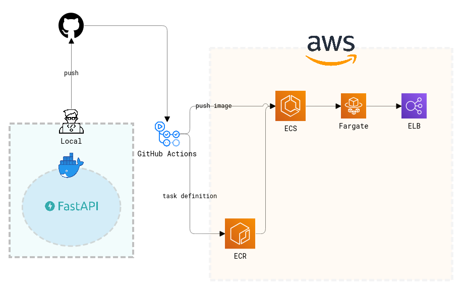

# ALPHA PROJECT
<div>
    <p align="center">
      
    </p>
    <p align="center">
        <em>.paint by dall-e-2</em>
    </p> 
    <p align="center">
        <strong>GitHub Repository</strong> <br>
        <a href="https://github.com/sangrokjung/alpha_male_Front"><strong> Mobile GitHub Repo</strong></a> · 
        <a href="https://github.com/sangrokjung/alpha_male_dl_server"><strong> DL Server GitHub Repo</strong></a>
    </p>
</div>


## About Project

<div>
    <p align="center">
        
        
    </p>
</div>

### KEY ACTIVITES
> **DL을 활용한 남성 얼굴 유형 분류.** <br>
> **사용자가 속한 유형별 남성 이미지 제공.**

### KEY RESOURCES
> **설문을 통한 분류한 남성 유명인 얼굴 유형 이미지 데이터.** <br>

### VALUE PROPOSITION
> **자신의 외모 유형이 궁금한 사람들을 AI를 통해 궁금증을 해소 할 수 있게 도와준다.** <br>
> **결과로 도출된 유형에 따라 사용자는 만족감을 얻거나 타인 지인과 비교하여 부가적인 즐거움을 얻을 수 있다.**

### CHANNELS
> **Application** <br>

### CUSTOMER SEGEMENTS
> **자신 또는 타인의 외모 유형이 궁금한 사람** <br>


## TECH Used

### MOBILE
<p align="left">
    
    
    
    
</p>

### BACK-END
<p align="left">
    
    
    
    
    
    
    
</p>

### CLOUD
<p align="left">
    
    
    
    
</p>

### DL/ML
<p align="left">
    
    
    
    
    
    
    </p>


## Project Team


**SangRok Jung** : <a href="https://github.com/sangrokjung" target="_blank">github</a> - sesilao@naver.com
> * Lead
>   * Project Lead.
>   * Managing GitHub Repositories and Policies.
>   * Notion, Upbase Management.
>   * Manage schedules.
>   * Planning and production of readme.
> * Back-End
>   * Imaging DL Servers with Dockers
>   * Leverage FastAPI to create POST Protocols for the Client to send.
>   * Create an API to call DL.
>   * Create an API that stores data sent by the Client in DB.
>   * Connect with DataBase.
> * Cloud
>   * Building an EC2 Ubuntu environment for DL learning. (G4dn, P4)
>   * Deploying DL Server CICD with GitHub Actions and S3, EC2.
>   * Deploying Back-End Server CICD with GitHub Actions and ECR, ECS, and ELB.
>   * Deploying RDBMS PostgreSQL using RDS.
> * DataBase.
>   *  Schema, table, and data CRUD utilizing PostgreSQL.
>   *  ERD Production.
> * Mobile
>   * Design with Mockup.
> * DL/ML
>   * Collection of data through crawling.


**Seungwon Lee** : <a href="https://github.com/diet-teacher" target="_blank">github</a> - lsw4556@daum.net
> * DL/ML
>   * Collection of data through crawling.
>   * Analyse surveyed data and visualized it using matplotlib and pandas
>   * Trained the first DL model to find out human face is exist using Pytorch
>   * Trained the second DL model that for auto labeling using Pytorch
>   * Trained the third DL model to detect three parts of faces and classify there class using Pytorch

**Jaehee Han** : <a href="https://github.com/82Hardy-J" target="_blank">github</a> - handjh6903@naver.com
> * Team work
>   * Execute Leader's Command, Compliance with project rules.
> * Mobile
>   * Camera function and album function were activated using Image Picker.
>   * It makes a request to the server using HTTP and Post and responds with information.
>   * Parse the data received as a response using HTTP and put
>   * Give the user MainPage, SelectPage,Show the ResultPage.
>   * Create the features required for each page.
>   * Designed the app logo.
> * DL/ML
>   * Collection of data through crawling.


---


## BACK-END SERVER

**Before building a DL server, build a backend server to develop protocols to send and receive with the Client.**

### Structuring FastAPI

```bash
app
├── __init__.py
├── main.py
├── core
│   ├── models
│   │   ├── database.py
│   │   ├── models.py
│   │   └── __init__.py
│   └── schemas
│       ├── __init__.py
│       └── schema.py
└── v1
    ├── api.py
    ├── load.py
    ├── s3.py
    └── __init__.py 
```

> #### models
> * Import the same database session or object from v1
> #### schemas
> * My Pydantic models. Used for creating OpenAPI schemas since FastAPI is based on OpenAPI specification we use schemas everywhere, from Swagger generation to endpoint's expected request body.
> #### v1
> * used for creating OpenAPI schemas since FastAPI is based on OpenAPI specification we use schemas everywhere, from Swagger generation to endpoint's expected request body.

### API
**1. In the Client, enter the result value of any DL in the parameter and the remaining data in the request body as agreed with USER DATA.**<br>
**2. According to the parameter result value entered by the client, USER DATA is stored in the DB, and the client obtains the Response body value.**
```python
    @router.post("/RegisterUserImg_sample")
    async def RegisterUserImg_sample(first_user: first_user_tbl, Model_rst:int, result: last_result, db: Session = Depends(get_db)):
        c_first_user = models.Users()
        c_first_user.user_img = first_user.user_img
        c_first_user.age = first_user.age
        c_first_user.mbti = first_user.mbti
    
        Model_rst
    
        if Model_rst == 0 or Model_rst == 6:
            return result
        elif Model_rst >= 1 and Model_rst < 6:
            s3_url = handle_upload_img(first_user.user_img) # S3에 파일을 전송함과 동시에\ 주소 획득.
            Model_rst = Model_rst
            result.human = "True"
            type = conv_type(Model_rst)
            if Model_rst == 1:
                result.male_type = "Alpha"
                result.dsc = db.query(models.Male).filter(models.Male.male_type == "alpha").first().dsc_text
                ID = make_4_num(27, 36)
                result.img1 = db.query(models.Male_IMG).filter(models.Male_IMG.male_id == Model_rst, models.Male_IMG.id == ID[0]).first().url
                result.img2 = db.query(models.Male_IMG).filter(models.Male_IMG.male_id == Model_rst, models.Male_IMG.id == ID[1]).first().url
                result.img3 = db.query(models.Male_IMG).filter(models.Male_IMG.male_id == Model_rst, models.Male_IMG.id == ID[2]).first().url
                result.img4 = db.query(models.Male_IMG).filter(models.Male_IMG.male_id == Model_rst, models.Male_IMG.id == ID[3]).first().url
            elif Model_rst == 2:
                result.male_type = "Beta"
                result.dsc = db.query(models.Male).filter(models.Male.male_type == "beta").first().dsc_text
                ID = make_4_num(37, 49)
                result.img1 = db.query(models.Male_IMG).filter(models.Male_IMG.male_id == Model_rst, models.Male_IMG.id == ID[0]).first().url
                result.img2 = db.query(models.Male_IMG).filter(models.Male_IMG.male_id == Model_rst, models.Male_IMG.id == ID[1]).first().url
                result.img3 = db.query(models.Male_IMG).filter(models.Male_IMG.male_id == Model_rst, models.Male_IMG.id == ID[2]).first().url
                result.img4 = db.query(models.Male_IMG).filter(models.Male_IMG.male_id == Model_rst, models.Male_IMG.id == ID[3]).first().url
            elif Model_rst == 3:
                result.male_type = "Gamma"
                result.dsc = db.query(models.Male).filter(models.Male.male_type == "gamma").first().dsc_text
                ID = make_4_num(50, 62)
                result.img1 = db.query(models.Male_IMG).filter(models.Male_IMG.male_id == Model_rst, models.Male_IMG.id == ID[0]).first().url
                result.img2 = db.query(models.Male_IMG).filter(models.Male_IMG.male_id == Model_rst, models.Male_IMG.id == ID[1]).first().url
                result.img3 = db.query(models.Male_IMG).filter(models.Male_IMG.male_id == Model_rst, models.Male_IMG.id == ID[2]).first().url
                result.img4 = db.query(models.Male_IMG).filter(models.Male_IMG.male_id == Model_rst, models.Male_IMG.id == ID[3]).first().url
            elif Model_rst == 4:
                result.male_type = "Delta"
                result.dsc = db.query(models.Male).filter(models.Male.male_type == "delta").first().dsc_text
                ID = make_4_num(63, 73)
                result.img1 = db.query(models.Male_IMG).filter(models.Male_IMG.male_id == Model_rst, models.Male_IMG.id == ID[0]).first().url
                result.img2 = db.query(models.Male_IMG).filter(models.Male_IMG.male_id == Model_rst, models.Male_IMG.id == ID[1]).first().url
                result.img3 = db.query(models.Male_IMG).filter(models.Male_IMG.male_id == Model_rst, models.Male_IMG.id == ID[2]).first().url
                result.img4 = db.query(models.Male_IMG).filter(models.Male_IMG.male_id == Model_rst, models.Male_IMG.id == ID[3]).first().url
            elif Model_rst == 5:
                result.male_type = "Omega"
                result.dsc = db.query(models.Male).filter(models.Male.male_type == "omega").first().dsc_text
                ID = make_4_num(74, 84)
                result.img1 = db.query(models.Male_IMG).filter(models.Male_IMG.male_id == Model_rst, models.Male_IMG.id == ID[0]).first().url
                result.img2 = db.query(models.Male_IMG).filter(models.Male_IMG.male_id == Model_rst, models.Male_IMG.id == ID[1]).first().url
                result.img3 = db.query(models.Male_IMG).filter(models.Male_IMG.male_id == Model_rst, models.Male_IMG.id == ID[2]).first().url
                result.img4 = db.query(models.Male_IMG).filter(models.Male_IMG.male_id == Model_rst, models.Male_IMG.id == ID[3]).first().url
            c_first_user.user_img_s3_url = s3_url
            c_first_user.cft_result = type
            c_first_user.created_at = datetime.now()
            c_first_user.created_by = "JSR"
            db.add(c_first_user)
            db.commit()
    
            return result
```

### CICD
**1. In the local reincarnation, the developer pushes to GitHub.** <br>
**2. GitHub Action is executed.** <br>
**3. GitHub Action pushes dcooker image to ECR according to yml file.** <br>
**4. GitHub Action performs ECS task definition according to the yml file.** <br>
**5. Distribute the server to ELB according to the configured service.**<br>
<p align="center">
    
</p>

## DL Server

**When the client calls the server's API, the result value is stored in the DB and S3 Bucket through DL MODEL learned and the response body is returned to the client.**

### API
**1. USER DATA sent by Client is entered.** <br>
**2. Return the result value through DL MODEL, which has learned USER IMG of USER DATA.**<br>
**3. Depending on the result value of DL MODEL, the response body is sent to the client according to the protocol set, and data is stored in DB and S3.**<br>

```python
@router.post("/RegisterResult")
async def RegisterResult(first_user: first_user_tbl, result: last_result, db: Session = Depends(get_db)):
    c_first_user = models.Users()
    c_first_user.user_img = first_user.user_img
    c_first_user.age = first_user.age
    c_first_user.mbti = first_user.mbti

    Model_rst = run(first_user.user_img)

    if Model_rst == 0 or Model_rst == 6:
        return result
    elif Model_rst >= 1 and Model_rst < 6:
        s3_url = handle_upload_img(first_user.user_img)  # S3에 파일을 전송함과 동시에\ 주소 획득.
        Model_rst = Model_rst
        result.human = "True"
        type = conv_type(Model_rst)
        if Model_rst == 1:
            result.male_type = "Alpha"
            result.dsc = db.query(models.Male).filter(models.Male.male_type == "alpha").first().dsc_text
            ID = make_4_num(27, 36)
            result.img1 = db.query(models.Male_IMG).filter(models.Male_IMG.male_id == Model_rst,
                                                           models.Male_IMG.id == ID[0]).first().url
            result.img2 = db.query(models.Male_IMG).filter(models.Male_IMG.male_id == Model_rst,
                                                           models.Male_IMG.id == ID[1]).first().url
            result.img3 = db.query(models.Male_IMG).filter(models.Male_IMG.male_id == Model_rst,
                                                           models.Male_IMG.id == ID[2]).first().url
            result.img4 = db.query(models.Male_IMG).filter(models.Male_IMG.male_id == Model_rst,
                                                           models.Male_IMG.id == ID[3]).first().url
        elif Model_rst == 2:
            result.male_type = "Beta"
            result.dsc = db.query(models.Male).filter(models.Male.male_type == "beta").first().dsc_text
            ID = make_4_num(37, 49)
            result.img1 = db.query(models.Male_IMG).filter(models.Male_IMG.male_id == Model_rst,
                                                           models.Male_IMG.id == ID[0]).first().url
            result.img2 = db.query(models.Male_IMG).filter(models.Male_IMG.male_id == Model_rst,
                                                           models.Male_IMG.id == ID[1]).first().url
            result.img3 = db.query(models.Male_IMG).filter(models.Male_IMG.male_id == Model_rst,
                                                           models.Male_IMG.id == ID[2]).first().url
            result.img4 = db.query(models.Male_IMG).filter(models.Male_IMG.male_id == Model_rst,
                                                           models.Male_IMG.id == ID[3]).first().url
        elif Model_rst == 3:
            result.male_type = "Gamma"
            result.dsc = db.query(models.Male).filter(models.Male.male_type == "gamma").first().dsc_text
            ID = make_4_num(50, 62)
            result.img1 = db.query(models.Male_IMG).filter(models.Male_IMG.male_id == Model_rst,
                                                           models.Male_IMG.id == ID[0]).first().url
            result.img2 = db.query(models.Male_IMG).filter(models.Male_IMG.male_id == Model_rst,
                                                           models.Male_IMG.id == ID[1]).first().url
            result.img3 = db.query(models.Male_IMG).filter(models.Male_IMG.male_id == Model_rst,
                                                           models.Male_IMG.id == ID[2]).first().url
            result.img4 = db.query(models.Male_IMG).filter(models.Male_IMG.male_id == Model_rst,
                                                           models.Male_IMG.id == ID[3]).first().url
        elif Model_rst == 4:
            result.male_type = "Delta"
            result.dsc = db.query(models.Male).filter(models.Male.male_type == "delta").first().dsc_text
            ID = make_4_num(63, 73)
            result.img1 = db.query(models.Male_IMG).filter(models.Male_IMG.male_id == Model_rst,
                                                           models.Male_IMG.id == ID[0]).first().url
            result.img2 = db.query(models.Male_IMG).filter(models.Male_IMG.male_id == Model_rst,
                                                           models.Male_IMG.id == ID[1]).first().url
            result.img3 = db.query(models.Male_IMG).filter(models.Male_IMG.male_id == Model_rst,
                                                           models.Male_IMG.id == ID[2]).first().url
            result.img4 = db.query(models.Male_IMG).filter(models.Male_IMG.male_id == Model_rst,
                                                           models.Male_IMG.id == ID[3]).first().url
        elif Model_rst == 5:
            result.male_type = "Omega"
            result.dsc = db.query(models.Male).filter(models.Male.male_type == "omega").first().dsc_text
            ID = make_4_num(74, 84)
            result.img1 = db.query(models.Male_IMG).filter(models.Male_IMG.male_id == Model_rst,
                                                           models.Male_IMG.id == ID[0]).first().url
            result.img2 = db.query(models.Male_IMG).filter(models.Male_IMG.male_id == Model_rst,
                                                           models.Male_IMG.id == ID[1]).first().url
            result.img3 = db.query(models.Male_IMG).filter(models.Male_IMG.male_id == Model_rst,
                                                           models.Male_IMG.id == ID[2]).first().url
            result.img4 = db.query(models.Male_IMG).filter(models.Male_IMG.male_id == Model_rst,
                                                           models.Male_IMG.id == ID[3]).first().url
        c_first_user.user_img_s3_url = s3_url
        c_first_user.cft_result = type
        c_first_user.created_at = datetime.now()
        c_first_user.created_by = "JSR"
        db.add(c_first_user)
        db.commit()

        return result
```

### CICD
**1-1. Push MODEL WEIGHT and deploy.sh files into the S3 bucket using AWS CLI in a local environment.**<br>
**1-2. Import the deploy.sh file of S3 bucket from EC2 to CLI.**<br>
**1-3. Push DL SERVER to GitHub in a local environment.**<br>
**2. GitHub Actions works.**<br>
**2-1. Upload the code to the S3 bucket according to the yml file created by GitHub Actions.**<br>
**3. Execute the SSM command of MODEL SERVER according to the yml file created by GitHub Actions.**<br>
**3-1. MODEL SERVER brings the MODEL WEIGHT of the bucket through the CLI.**<br>
**3-2. Construct the docker images.**<br>
**3-3. Run the docker container.**<br>
**4. If the container is already running, stop and run 3-2 through 3-3.**<br>
<p align="center">
    
</p>

